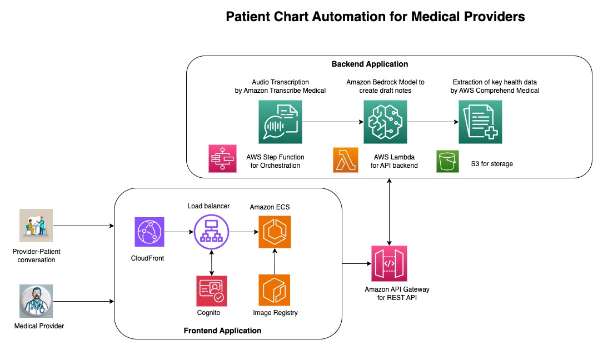

# GenAI Medical Chart Automation

## Problem Statement

In the health care sector, one challenge that medical providers face is effectively and adequately capturing key details from routine patient consultations. Adequate diagnosis and prognosis often requires analyzing previous medical records and complaints to identify trends. The crucial tasks like patient charting, patient history analysis and complaints takes considerable amount of time for medical providers and takes away the time they could otherwise use to spend more time with their patients. Due to the nature of the health care sector which often requires medical providers to multitask and consult large volume of patients on a continuous schedule, there is also a risk of missing out key context information which relates to patient history, current complaints which directly impacts diagnosis and prognosis and can have an adverse effect on the quality of care a patient receives from their medical provider.

## Solution

A Generative AI powered application can serve as a medical provider’s assistant to help automate routine documentation components and extracting key data. This application will allows providers to focus on capturing higher value clinical insights and patient details in their charting. This can significantly boost efficiency and allow more time for direct patient care. The specific use cases for this application are:

- **Automatically generate chart notes from patient-provider conversations** - The application will analyze audio recordings of appointments and create draft notes, which reduces typing
- **Extract key data from charts** - The application can identify and highlight important info like test results, procedures, diagnoses, action items from charts.
- **Patient Education** - The solution will automatically extract the key medical diagnosis from the conversation and provide detailed description of the medical condition for patient education 

This repository contains code for a Generative AI powered solution to automate medical charts for medical providers

## Architecture Diagram

## Deploy Infrastructure

### Prerequisites

- **Route 53 Hosted Zone** - Create a Route 53 Public hosted zone that will be used for this solution. An existing Public Route 53 hosted zone can also be used e.g. example.com
- **AWS Certificate Manager Certificate** - Provision an AWS Certificate Manager TLS Certificate for the Route 53 Hosted Zone domain namme and its applicable subdomains e.g. example.com and *.example.com for all subdomains. This certificate will be used to configure HTTPS on CloudFront and origin Load balancer
- **Note down Deployment Parameters**:
    - **Frontend App Custom Domain name** - A custom domain name that will be used to access the frontend sample application. The domain name provided will be used to create a Route 53 DNS record pointing to the frontend cloudfront distribution e.g. app.example.com
    - **Load balancer origin custom domain name** - A custom domian name to be used for the CloudFront distribution load balancer origin. The domain name provided will be used to create a Route 53 DNS record pointing to the origin load balancer e.g. app-lb.example.com
    - **Route 53 Hosted Zone ID** - The Route 53 hosted zone ID to host the custom domain names provided above e.g. ZXXXXXXXXYYYYYYYYY
    - **Route 53 Hosted Zone Name** - The name of the Route 53 hosted zone to host the custom domain names provided above e.g. example.com
    - **AWS ACM Certificate ARN** - The ARN of the ACM Certificate to be used with the custom domain provided

### Deployment
> **NOTE:** Ensure Docker is installed and running on the workstation that will be used for CDK deployment

Go into the CDK directory

    $ cd cdk

Add contexts to deploy the CDK stack. Create a file `cdk.context.json` and provide the context as seen below

    {
        "appCustomDomainName": "<Frontend App domain name from prerequisites>",
        "loadBalancerOriginCustomDomainName": "<Load balancer origin domain name from prerequisites>",
        "customDomainRoute53HostedZoneID": "<R53 hosted zone ID from prerequisites>",
        "customDomainRoute53HostedZoneName": "<R53 hosted zone name from prerequisites>",
        "customDomainCertificateArn": "<ACM certificate ARN from prerequisites>"
    }

Deploy the stack using CDK

    $ cdk deploy --all

## Connect to application

Connect to the application using the domain provided in `appCustomDomainName`
